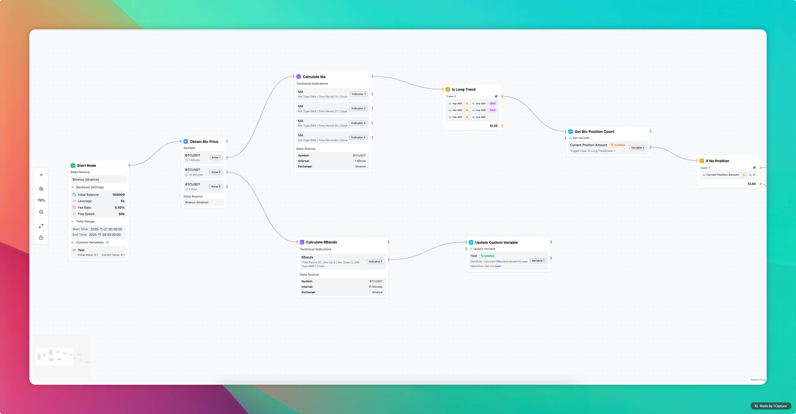
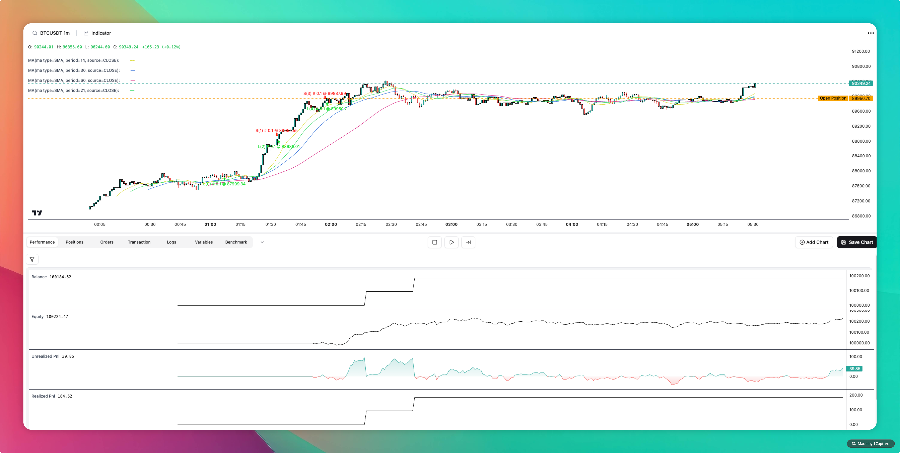
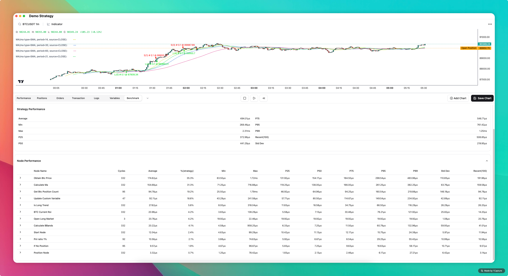
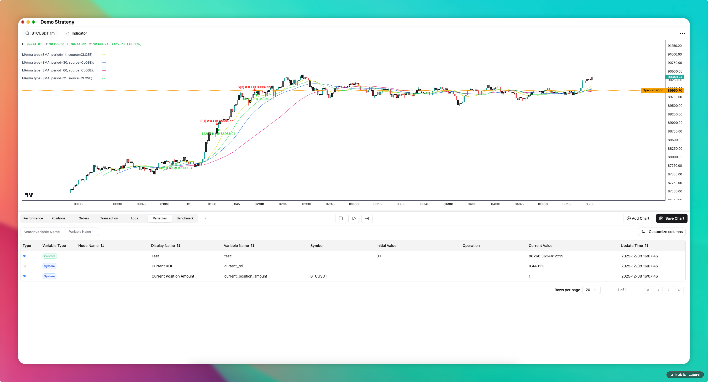

# Star River

[English](./README.md) | [中文](./README_CN.md)

Star River 是一款基于可视化工作流的量化交易策略平台。通过直观的拖拽式节点编辑器，无需编写任何代码即可构建、回测和执行复杂的量化交易策略。

## 快速开始

安装 Star River 客户端，即可开始构建策略。[下载地址](https://github.com/jabori-zy/star-river/releases)

## 预览

## 核心功能

### 🔗 可视化工作流引擎

采用节点式编程范式，通过拖拽连接即可构建完整的交易策略逻辑。

**支持的节点类型：**

| 节点类型 | 功能描述 |
|---------|---------|
| 开始节点 | 策略入口点，定义执行触发条件和初始变量 |
| K线节点 | 获取多平台、多交易对、多周期的行情数据 |
| 指标节点 | 计算技术指标，支持 100+ 种指标类型 |
| 条件节点 | 实现复杂的逻辑分支判断 |
| 期货订单节点 | 执行期货交易（市价/限价/止损单） |
| 仓位管理节点 | 管理持仓（平仓、调整仓位） |
| 变量节点 | 自定义变量的读取、设置与运算 |

### 📊 多维度数据源

通过 K线节点灵活配置数据获取：

- **多平台支持**：当前已支持 Binance，更多交易所持续接入中
- **多交易对**：支持主流加密货币交易对
- **多时间周期**：从分钟级到日线级别全覆盖

### 📈 专业指标库

集成 TA-Lib 技术分析库，涵盖六大类 100+ 种专业指标：

| 指标类别 | 包含指标示例 |
|---------|-------------|
| 动量指标 | RSI、MACD、ADX、CCI、威廉指标等 |
| 趋势指标 | SMA、EMA、布林带、SAR 等 |
| 波动率指标 | ATR、标准差等 |
| 成交量指标 | OBV、AD 等 |
| 形态识别 | 十字星、锤子线、吞没形态等 60+ 种 K线形态 |
| 周期指标 | 希尔伯特变换系列指标 |

### 🔀 灵活的条件逻辑

条件节点支持丰富的比较运算符和逻辑组合，轻松实现：
- 多条件与/或组合
- 指标交叉判断
- 阈值突破检测
- 时间窗口过滤

### 📋 变量系统

**自定义变量**：支持数字、字符串、布尔值、时间、枚举、百分比等 6 种类型

**系统变量**：实时获取策略运行状态
- 当前时间、市场状态
- 持仓数量、持仓盈亏
- 订单状态、累计收益率

### 🔄 回测引擎

- 基于历史数据的策略回测
- 实时可视化回测进度
- 详细的绩效分析报告
- 订单记录与持仓变化追踪

## 未来规划

### 功能开发

| 状态 | 功能 | 描述 |
|:---:|------|------|
| [ ] | 更多交易所支持 | 接入 OKX、Bybit、Bitget 等主流交易所 |
| [ ] | 支持Metatrader 5 | 支持Metatrader 5 |
| [ ] | 自定义指标 | 支持用户自定义技术指标公式 |
| [ ] | 自定义因子 | 支持量化因子的定义与计算 |
| [ ] | 策略模板 | 提供常用策略模板，一键导入使用 |
| [ ] | 实盘交易 | 构建完成的工作流通过运行模式切换，一键切换为实盘模式 |
| [ ] | 模拟交易 | 构建完成的工作流通过运行模式切换，一键切换为模拟模式 |
| [ ] | 自定义通知 | 支持自定义通知方式，如邮件、短信、Telegram等 |
| [ ] | 风控模块 | 全局风险控制与预警机制 |
| [ ] | 策略分享 | 社区策略分享与导入功能 |

## 许可证

MIT License

## 作者

Jabori
