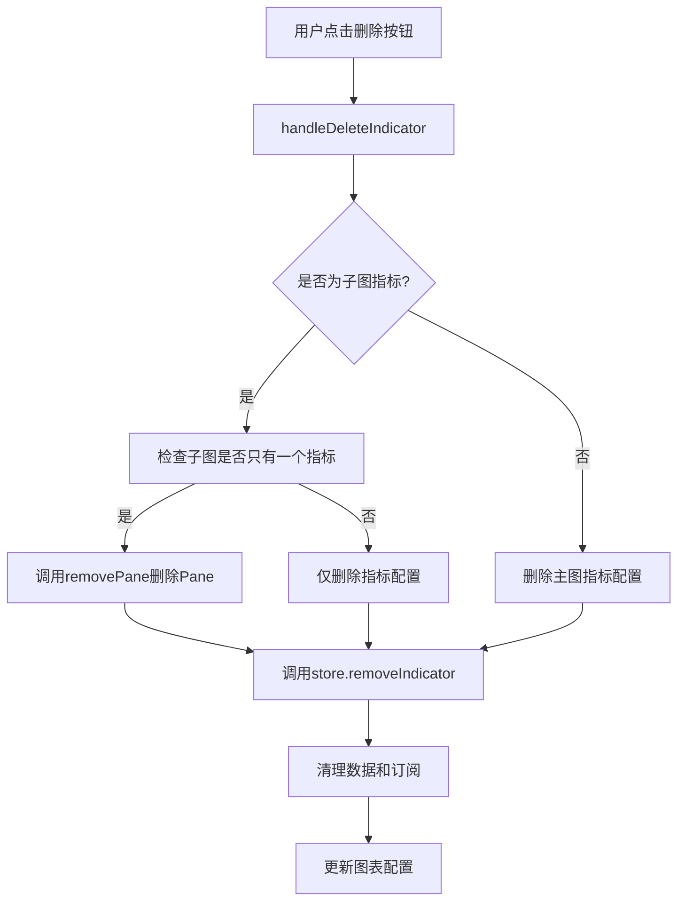

# 指标删除功能实现文档

## 概述

本文档描述了在图表组件中实现指标删除功能的详细实现方案。该功能允许用户通过点击指标图例上的删除图标来删除主图指标或子图指标。

## 功能特性

### 主要功能
1. **主图指标删除**：删除主图中的指标，从 `klineChartConfig.indicatorChartConfig` 中移除
2. **子图指标删除**：删除子图中的指标，从 `subChartConfigs` 中移除
3. **自动Pane管理**：当子图中的最后一个指标被删除时，自动删除对应的Pane
4. **数据清理**：删除指标时自动清理相关的数据和订阅

### 用户界面
- 在指标图例上悬浮时显示操作按钮
- 删除按钮使用红色垃圾桶图标
- 点击删除按钮立即执行删除操作

## 技术实现

### 1. Store层实现

在 `backtest-chart-store.ts` 中添加了 `removeIndicator` 方法：

```typescript
removeIndicator: (indicatorKeyStr: IndicatorKeyStr) => void;
```

该方法的主要逻辑：
1. 检查指标是主图指标还是子图指标
2. 从相应的配置中删除指标
3. 如果子图没有其他指标，删除整个子图配置
4. 清理指标数据和可见性状态
5. 清理相关订阅

### 2. 组件层实现

#### IndicatorLegend 组件
- 添加了 `chartApiRef` 属性用于访问图表API
- 实现了 `handleDeleteIndicator` 方法处理删除逻辑
- 对于子图指标，调用 `chartApiRef.current.removePane()` 删除Pane

#### MainChartIndicatorLegend 组件
- 传递 `chartApiRef` 到 `IndicatorLegend` 组件

#### SubChartIndicatorLegend 组件
- 传递 `chartApiRef` 到 `IndicatorLegend` 组件

#### SubChartIndicatorSeries 组件
- 接收并传递 `chartApiRef` 属性

#### BacktestChart 组件
- 将 `chartApiRef` 传递给所有相关的子组件

### 3. 删除逻辑流程



## 代码示例

### 删除处理函数
```typescript
const handleDeleteIndicator = (e: React.MouseEvent) => {
    e.stopPropagation();
    
    // 检查是否是子图指标
    const isSubChartIndicator = chartConfig.subChartConfigs.some(
        subChart => subChart.indicatorChartConfigs[indicatorKeyStr]
    );
    
    if (isSubChartIndicator && chartApiRef?.current) {
        // 找到对应的子图索引
        const subChartIndex = chartConfig.subChartConfigs.findIndex(
            subChart => subChart.indicatorChartConfigs[indicatorKeyStr]
        );
        
        if (subChartIndex !== -1) {
            const subChartConfig = chartConfig.subChartConfigs[subChartIndex];
            
            // 如果子图只有这一个指标，删除整个Pane
            if (Object.keys(subChartConfig.indicatorChartConfigs).length === 1) {
                try {
                    const panes = chartApiRef.current.panes();
                    const paneIndex = subChartIndex + 1; // 子图的Pane索引
                    
                    if (panes[paneIndex]) {
                        chartApiRef.current.removePane(paneIndex);
                    }
                } catch (error) {
                    console.error('删除Pane失败:', error);
                }
            }
        }
    }
    
    // 从配置中删除指标
    removeIndicator(indicatorKeyStr);
};
```

## 测试

### 测试配置
在 `TestPage` 中创建了包含主图和子图指标的测试配置：
- 主图指标：MA_20
- 子图指标：MACD_12_26_9, RSI_14, VOLUME

### 测试步骤
1. 访问 `/test` 页面
2. 悬浮在指标图例上查看删除按钮
3. 点击删除按钮测试删除功能
4. 验证指标是否正确删除
5. 验证子图Pane是否正确删除

## 注意事项

1. **Pane索引计算**：子图的Pane索引 = 主图(0) + 子图索引 + 1
2. **错误处理**：删除Pane时添加了try-catch错误处理
3. **数据一致性**：删除指标时同时清理数据、可见性状态和订阅
4. **用户体验**：删除操作立即生效，无需确认对话框

## 扩展性

该实现具有良好的扩展性：
1. 可以轻松添加删除确认对话框
2. 可以添加撤销删除功能
3. 可以扩展到其他类型的图表元素删除
4. 支持批量删除操作

## 相关文件

- `src/components/chart/backtest-chart/backtest-chart-store.ts`
- `src/components/chart/backtest-chart/legend/indicator-legend.tsx`
- `src/components/chart/backtest-chart/main-chart-indicator-legend.tsx`
- `src/components/chart/backtest-chart/sub-chart-indicator-legend.tsx`
- `src/components/chart/backtest-chart/sub-chart-indicator-series.tsx`
- `src/components/chart/backtest-chart/index.tsx`
- `src/pages/TestPage/index.tsx`
